# 📱 Códigos QR del Parque de la Bellota

Códigos QR generados automáticamente para enlaces del sitio.

## Códigos disponibles

### `elparquedelabellotapolimata-labcom_home.png`

**URL:** https://elparquedelabellota.polimata-lab.com

---

### `elparquedelabellotapolimata-labcom_descubre.png`

**URL:** https://elparquedelabellota.polimata-lab.com/descubre

---

### `elparquedelabellotapolimata-labcom_mapa.png`

**URL:** https://elparquedelabellota.polimata-lab.com/mapa

---

### `elparquedelabellotapolimata-labcom_fauna-y-flora.png`

**URL:** https://elparquedelabellota.polimata-lab.com/fauna-y-flora

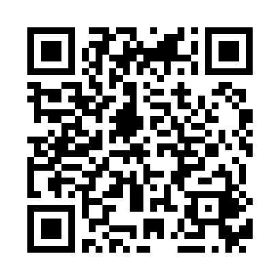

---

### `elparquedelabellotapolimata-labcom_actividades.png`

**URL:** https://elparquedelabellota.polimata-lab.com/actividades

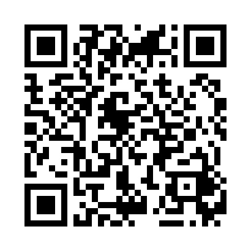

---

### `elparquedelabellotapolimata-labcom_recursos.png`

**URL:** https://elparquedelabellota.polimata-lab.com/recursos

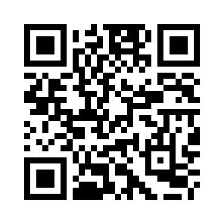

---

### `elparquedelabellotapolimata-labcom_rutas.png`

**URL:** https://elparquedelabellota.polimata-lab.com/rutas

---

### `elparquedelabellotapolimata-labcom_noticias.png`

**URL:** https://elparquedelabellota.polimata-lab.com/noticias

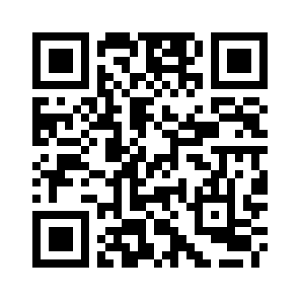

---

### `elparquedelabellotapolimata-labcom_aveabubilla-comun.png`

**URL:** https://elparquedelabellota.polimata-lab.com/ave/abubilla-comun

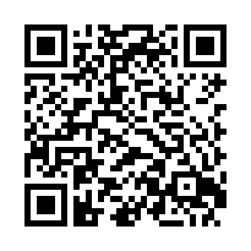

---

### `elparquedelabellotapolimata-labcom_avebuitre-negro.png`

**URL:** https://elparquedelabellota.polimata-lab.com/ave/buitre-negro

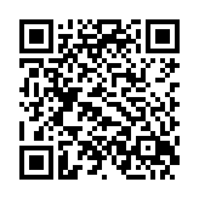

---

### `elparquedelabellotapolimata-labcom_avepaloma-torcaz.png`

**URL:** https://elparquedelabellota.polimata-lab.com/ave/paloma-torcaz

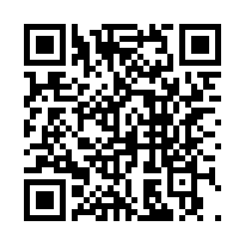

---

### `elparquedelabellotapolimata-labcom_avepico-picapinos.png`

**URL:** https://elparquedelabellota.polimata-lab.com/ave/pico-picapinos

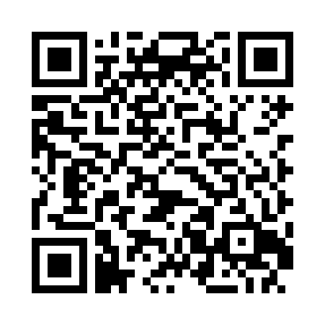

---

### `elparquedelabellotapolimata-labcom_averabilargo-iberico.png`

**URL:** https://elparquedelabellota.polimata-lab.com/ave/rabilargo-iberico

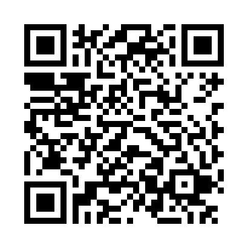

---

### `elparquedelabellotapolimata-labcom_aveurraca-comun.png`

**URL:** https://elparquedelabellota.polimata-lab.com/ave/urraca-comun

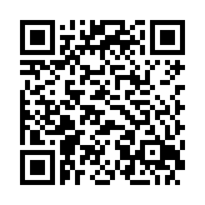

---

### `elparquedelabellotapolimata-labcom_recursos_topografia.png`

**URL:** https://elparquedelabellota.polimata-lab.com/recursos#topografia

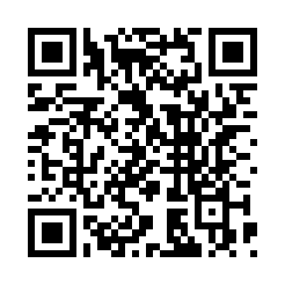

---

### `elparquedelabellotapolimata-labcom_recursos_geologia.png`

**URL:** https://elparquedelabellota.polimata-lab.com/recursos#geologia

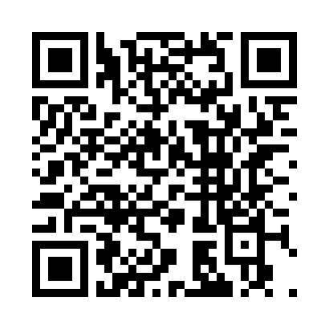

---

### `elparquedelabellotapolimata-labcom_recursos_flora-y-fauna.png`

**URL:** https://elparquedelabellota.polimata-lab.com/recursos#flora-y-fauna

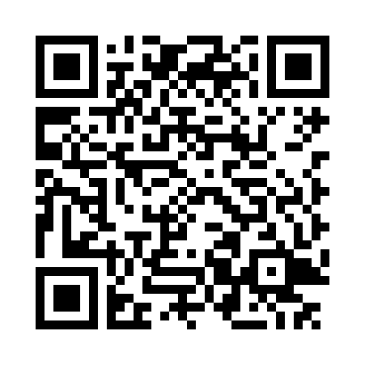

---

### `elparquedelabellotapolimata-labcom_recursos_actividades-educativas.png`

**URL:** https://elparquedelabellota.polimata-lab.com/recursos#actividades-educativas

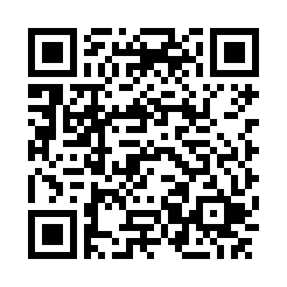

---

### `elparquedelabellotapolimata-labcom_recursos_paneles.png`

**URL:** https://elparquedelabellota.polimata-lab.com/recursos#paneles

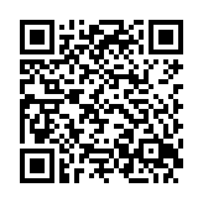

---

### `elparquedelabellotapolimata-labcom_recursos_normas-y-recomendaciones.png`

**URL:** https://elparquedelabellota.polimata-lab.com/recursos#normas-y-recomendaciones

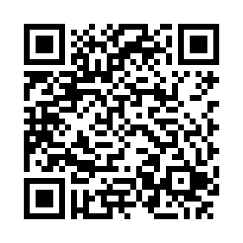

---

### `elparquedelabellotapolimata-labcom_20251018apertura-sitio.png`

**URL:** https://elparquedelabellota.polimata-lab.com/2025/10/18/apertura-sitio

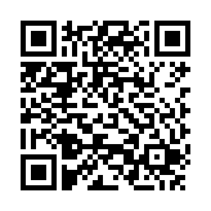

---

### `elparquedelabellotapolimata-labcom_20251019mejoras-continuas.png`

**URL:** https://elparquedelabellota.polimata-lab.com/2025/10/19/mejoras-continuas

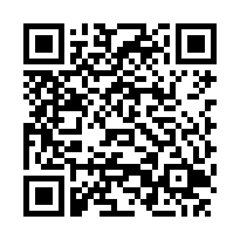

---

